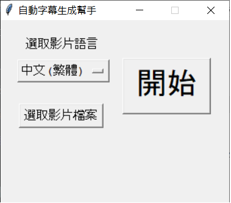
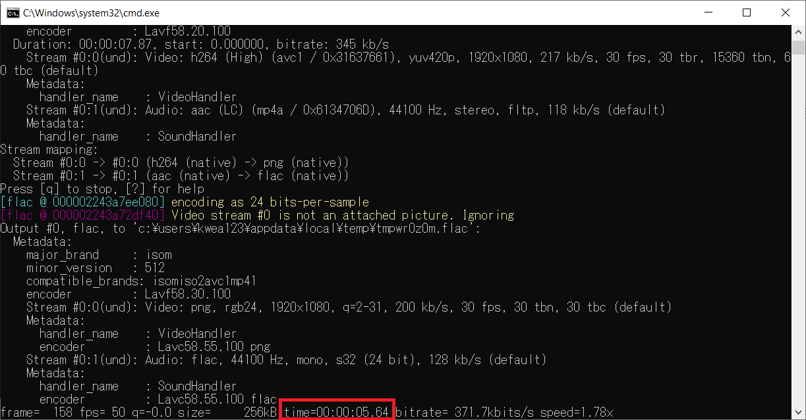
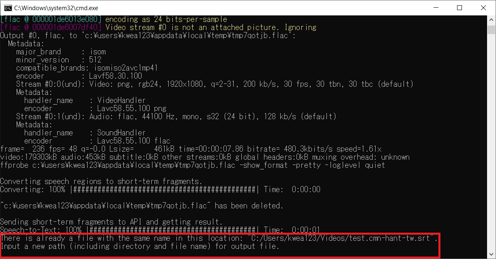

# Autosub - 為你的影片自動上字幕！

This is part of the [OpenVTuberProject](https://github.com/kwea123/OpenVTuberProject), which provides many toolkits for becoming a VTuber.

原本的project在[這裡](https://github.com/BingLingGroup/autosub)，我幾乎都是從他那裡搬來的，然後做了一個使用者介面而已。

[youtube影片介紹](https://youtu.be/ejom1M7lG-Q)

## 使用方法

### 0.  作業系統
我只知道用windows 10 64位元可以唷啾咪^.<

### 1.  下載可執行檔 
到[這裡](https://github.com/kwea123/autosub/releases/tag/0.6.0)下載可執行檔並解壓縮。(只要下載`autosub_release.zip
`就可以了，`Source code`不用)

### 2.  執行自動上字幕
打開`autosub_gui.exe`，你會看到以下的畫面：

然後就
1.  選取語言 (目前只有支持簡/繁中文、英文、日文而已，如果有人需要別的語言請發[issue](https://github.com/kwea123/autosub/issues))
2.  選取影像檔 (我只知道`.mp4`一定可以，其他的影像格式大家可以嘗試看看，如果不行請發[issue](https://github.com/kwea123/autosub/issues)) **注意：在影像路徑裡請不要包含中文或是空格，只能是英文！**
3.  按右邊的開始按鈕

按完之後會跑出下面的畫面：

紅色框起來的地方是代表他現在處理完多少秒了。處理結束之後這個視窗會自動關閉。

如果你發現以下的錯誤，請不要擔心；

這只是代表那個路徑下已經有一個同名的字幕檔了，你只要在這個螢幕中輸入新的檔案路徑就可以了。

### 3.  編輯自動生成的字幕檔
最後這個軟體會生成`檔案名稱.srt`的字幕檔。
它是使用AI聲音辨識，當然也會有出錯，所以最後還是要自己看過一遍修正。
推薦使用[Aegisub](http://www.aegisub.org/)來編輯字幕檔。

## 如果還有其他問題
到[issue](https://github.com/kwea123/autosub/issues)提問。
